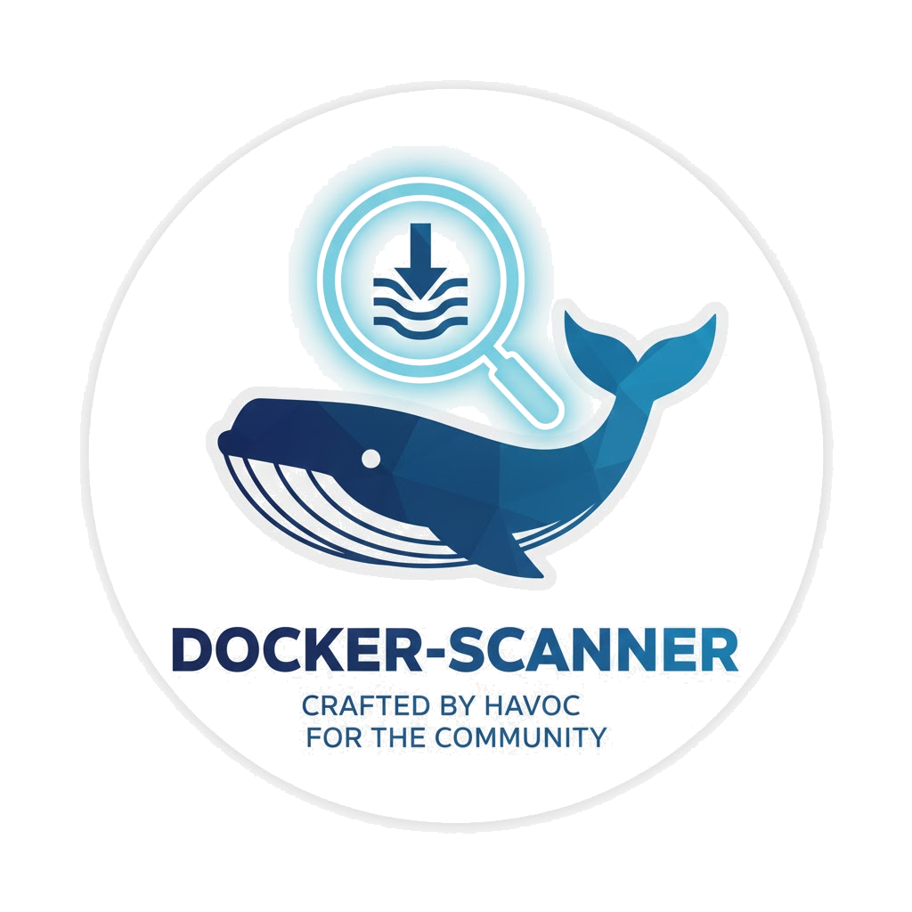

<h1 align="center">Docker & Container Misconfiguration Scanner</h1>
<p align="center">
<a href="https://github.com/Daniel-wambua/docker-scanner"><br /></a>
<i>A minimal, production-ready security scanner for Docker & containers</i>
<br />
<i>Detect misconfigurations in Dockerfiles, docker-compose files, and running containers</i>
<br />
<b>🐳 <a href="https://github.com/Daniel-wambua/docker-scanner">GitHub</a> | 🔒 <a href="#checks-performed">Security Checks</a></b> <br />
</p>

## Motive
To automate Docker security scanning and make it easier to catch misconfigurations before they reach production.
All checks are defined in pure Python with zero shell dependencies, using the Docker SDK directly.
I did it this way so that security teams don't need to f\*\*k around with complex security tools.

<details>
  <summary>About the Developer</summary>

> **Professional Background**<br>
> I'm an experienced security-focused full stack engineer with a passion for DevSecOps, container security, and automation. I believe the best judge of a developer is their code, and this scanner reflects my philosophy: security should be automated, fast, and easy to integrate.
>
> This Docker scanner project showcases practical security engineering: why manually review Docker configs when you can build systems that catch issues automatically? The entire scanning pipeline is designed for maximum efficiency and maintainability.

</details>

## Features

- **Dockerfile Analysis**: Detects latest tags, missing USER directives, sensitive ports, improper ADD usage, and missing health checks
- **Docker Compose Analysis**: Identifies containers running as root, missing resource limits, privileged mode, port exposure issues, and unpinned versions
- **Runtime Analysis**: Scans running containers for privilege escalation, resource limits, host network usage, and sensitive mount points
- **Multiple Output Formats**: Beautiful Rich tables or JSON for CI/CD integration
- **Zero Dependencies on Shell Commands**: Pure Python using Docker SDK

## Installation

```bash
git clone https://github.com/yourusername/docker-scanner.git
cd docker-scanner
pip install -r requirements.txt
```

Or install directly:

```bash
pip install docker pyyaml rich pytest
```

## Usage

Scan a Dockerfile:
```bash
python src/main.py --dockerfile path/to/Dockerfile
```

Scan a docker-compose file:
```bash
python src/main.py --compose path/to/docker-compose.yml
```

Scan running containers:
```bash
python src/main.py --runtime
```

Scan everything:
```bash
python src/main.py --dockerfile Dockerfile --compose docker-compose.yml --runtime
```

Output as JSON:
```bash
python src/main.py --dockerfile Dockerfile --json
```

## Example Output

```
╔═══════════════════════════════════════════════════════════════╗
║                                                               ║
║   ██████╗  ██████╗  ██████╗██╗  ██╗███████╗██████╗          ║
║   ██╔══██╗██╔═══██╗██╔════╝██║ ██╔╝██╔════╝██╔══██╗         ║
║   ██║  ██║██║   ██║██║     █████╔╝ █████╗  ██████╔╝         ║
║   ██║  ██║██║   ██║██║     ██╔═██╗ ██╔══╝  ██╔══██╗         ║
║   ██████╔╝╚██████╔╝╚██████╗██║  ██╗███████╗██║  ██║         ║
║   ╚═════╝  ╚═════╝  ╚═════╝╚═╝  ╚═╝╚══════╝╚═╝  ╚═╝         ║
║                                                               ║
║        Container Misconfiguration Scanner v1.0                ║
║                 Created by havoc                              ║
╚═══════════════════════════════════════════════════════════════╝

                   Misconfiguration Report                    
┏━━━━━━━━━━┳━━━━━━━━━━━━━━━━━━━━━━━━┳━━━━━━━━━━━━━━━━━━━━━━━━━┓
┃ Severity ┃ Check                  ┃ Details                 ┃
┡━━━━━━━━━━╇━━━━━━━━━━━━━━━━━━━━━━━━╇━━━━━━━━━━━━━━━━━━━━━━━━━┩
│ HIGH     │ Latest tag detected    │ Line 1: FROM ubuntu     │
│ MEDIUM   │ Missing USER directive │ Container runs as root  │
│ LOW      │ Missing HEALTHCHECK    │ No health monitoring    │
└──────────┴────────────────────────┴─────────────────────────┘
```

## Exit Codes

- `0`: No misconfigurations found
- `1`: Misconfigurations detected or error occurred

## CI/CD Integration

<details>
<summary>Click to expand CI/CD examples</summary>

Use in your CI pipeline with JSON output:

```bash
python src/main.py --dockerfile Dockerfile --json > scan-results.json
if [ $? -ne 0 ]; then
    echo "Security issues detected!"
    exit 1
fi
```

GitHub Actions example:

```yaml
- name: Scan Docker Configuration
  run: |
    pip install -r requirements.txt
    python src/main.py --dockerfile Dockerfile --compose docker-compose.yml
```

</details>

## Testing

Run the test suite:

```bash
pytest tests/ -v
```

All 37 tests cover:
- Dockerfile security checks
- Docker Compose configuration validation
- Container runtime analysis

## Checks Performed

<details>
<summary>Click to see all security checks</summary>

### Dockerfile
- ✅ Latest tag usage detection
- ✅ Missing USER directive (root user)
- ✅ Sensitive port exposure (22, 3389, 5432, 3306, 6379, 27017, 9200)
- ✅ ADD vs COPY misuse
- ✅ Missing HEALTHCHECK directive

### Docker Compose
- ✅ Containers running as root
- ✅ Missing memory limits
- ✅ Missing CPU limits
- ✅ Privileged mode enabled
- ✅ Sensitive ports exposed
- ✅ Unpinned image versions

### Runtime
- ✅ Privileged containers
- ✅ Containers without resource limits
- ✅ Host network mode usage
- ✅ Sensitive host path mounts (/, /etc, /var/run/docker.sock, /proc, /sys)

</details>

## How to Extend Checks

<details>
<summary>Click to see how to add custom checks</summary>

### Adding Dockerfile Checks

Edit `src/checks/dockerfile_checks.py` and add a new function:

```python
def check_new_rule(lines: list[str]) -> list[dict]:
    findings = []
    for i, line in enumerate(lines):
        if condition_met:
            findings.append({
                "severity": "HIGH",
                "check": "New rule name",
                "details": f"Line {i+1}: {line.strip()}"
            })
    return findings
```

Register the check in the `DOCKERFILE_CHECKS` list at the bottom of the file.

### Adding Compose Checks

Edit `src/checks/compose_checks.py` and add a new function:

```python
def check_new_compose_rule(config: dict) -> list[dict]:
    findings = []
    services = config.get("services", {})
    for name, service in services.items():
        if condition_met:
            findings.append({
                "severity": "MEDIUM",
                "check": "New compose rule",
                "details": f"Service '{name}': issue description"
            })
    return findings
```

Register the check in the `COMPOSE_CHECKS` list at the bottom of the file.

### Adding Runtime Checks

Edit `src/checks/container_runtime_checks.py` and add a new function:

```python
def check_new_runtime_rule(container) -> list[dict]:
    findings = []
    if condition_met:
        findings.append({
            "severity": "HIGH",
            "check": "New runtime rule",
            "details": f"Container {container.name}: issue description"
        })
    return findings
```

Register the check in the `RUNTIME_CHECKS` list at the bottom of the file.

</details>

## Requirements

- Python 3.10+
- Docker SDK for Python
- PyYAML
- Rich
- pytest (for testing)

## Contributing

### Pull Requests
Contributions welcome! Please ensure:
1. All tests pass: `pytest tests/ -v`
2. Code follows PEP8
3. New checks include corresponding tests
4. Functions remain pure and testable

### Issues
Found a bug or have a feature request? Open an issue with:
- Clear description of the problem
- Steps to reproduce
- Expected vs actual behavior
- Your environment (Python version, OS)

---

## Attribution
This project uses the following open-source libraries:

- [Docker SDK for Python](https://github.com/docker/docker-py)
- [Rich](https://github.com/Textualize/rich)
- [PyYAML](https://github.com/yaml/pyyaml)
- [pytest](https://github.com/pytest-dev/pytest)

---

## License

> _**[Docker Scanner](https://github.com/Daniel-wambua/docker-scanner)** is licensed under [MIT](https://github.com/Daniel-wambua/docker-scanner/blob/HEAD/LICENSE) © 2025._<br>
> <sup align="right">For information, see <a href="https://tldrlegal.com/license/mit-license">TLDR Legal > MIT</a></sup>

<details>
<summary>Expand License</summary>

```
The MIT License (MIT)
Copyright (c) 2025 Docker Scanner Contributors

Permission is hereby granted, free of charge, to any person obtaining a copy 
of this software and associated documentation files (the "Software"), to deal 
in the Software without restriction, including without limitation the rights 
to use, copy, modify, merge, publish, distribute, sub-license, and/or sell 
copies of the Software, and to permit persons to whom the Software is furnished 
to do so, subject to the following conditions:

The above copyright notice and this permission notice shall be included in all 
copies or substantial portions of the Software.

THE SOFTWARE IS PROVIDED "AS IS", WITHOUT WARRANTY OF ANY KIND, EXPRESS OR IMPLIED,
INCLUDING BUT NOT LIMITED TO THE WARRANTIES OF MERCHANTABILITY, FITNESS FOR A
PARTICULAR PURPOSE AND NON INFRINGEMENT. IN NO EVENT SHALL THE AUTHORS OR COPYRIGHT
HOLDERS BE LIABLE FOR ANY CLAIM, DAMAGES OR OTHER LIABILITY, WHETHER IN AN ACTION
OF CONTRACT, TORT OR OTHERWISE, ARISING FROM, OUT OF OR IN CONNECTION WITH THE
SOFTWARE OR THE USE OR OTHER DEALINGS IN THE SOFTWARE.
```

</details>

<!-- License + Copyright -->
<p align="center">
  <i>© Docker Scanner Contributors 2025</i><br>
  <i>Licensed under <a href="https://github.com/Daniel-wambua/docker-scanner/blob/main/LICENSE">MIT</a></i><br>
  <a href="https://github.com/Daniel-wambua/docker-scanner"></a><br>
  <sup>Thanks for visiting :)</sup>
</p>

<!-- Whale -->
<!-- 
                    ##         .
              ## ## ##        ==
           ## ## ## ## ##    ===
       /"""""""""""""""""\___/ ===
  ~~~ {~~ ~~~~ ~~~ ~~~~ ~~~ ~ /  ===- ~~~
       \______ o           __/
         \    \         __/
          \____\_______/
-->
